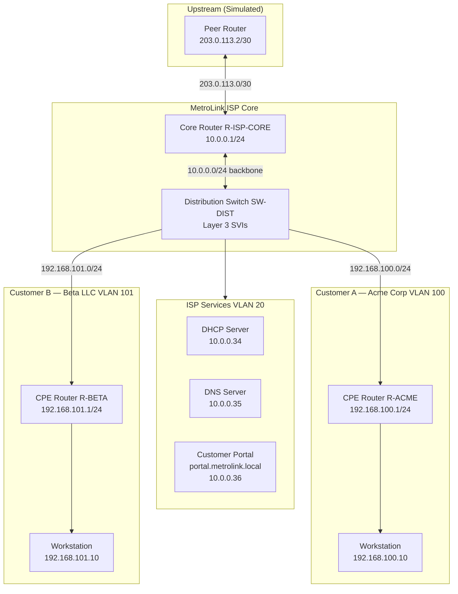

# Mini ISP Network Topology

## Overview

This simulation models **MetroLink ISP**, a small regional provider serving two business customers over a shared access network. Traffic flows from customer LANs through a distribution switch, across a core router, and out to a simulated upstream internet peer.

## Logical Topology

## Physical / Layer 2 Design

| Device | Role | Key Interfaces |
|--------|------|----------------|
| R-ISP-CORE | Default gateway, NAT, static routes to customers | Gi0/0 → upstream, Gi0/1 → backbone |
| SW-DIST | VLAN segmentation, inter-VLAN routing (optional L3) | Gi0/1 → core, Fa0/1–3 → access |
| R-ACME / R-BETA | Customer edge (CPE), NAT for outbound | WAN → ISP VLAN, LAN → customer subnet |
| SRV-DHCP-DNS | Centralized DHCP pools + internal DNS | VLAN 20 |

## VLAN Plan

| VLAN ID | Name | Subnet | Purpose |
|---------|------|--------|---------|
| 1 | default | — | Unused (native VLAN changed on trunks) |
| 10 | INFRA | 10.0.0.0/28 | Management & backbone |
| 20 | SERVICES | 10.0.0.32/27 | DHCP, DNS, portal |
| 100 | CUST-ACME | 192.168.100.0/24 | Customer A |
| 101 | CUST-BETA | 192.168.101.0/24 | Customer B |

## Traffic Flow Examples

### Customer A → Internet

1. PC `192.168.100.10` sends packet to `8.8.8.8`.
2. Default gateway `192.168.100.1` (R-ACME) NATs source to WAN IP.
3. R-ACME forwards to SW-DIST via VLAN 100.
4. SW-DIST routes to R-ISP-CORE (10.0.0.1).
5. R-ISP-CORE performs PAT and sends to upstream `203.0.113.2`.

### Customer A → Internal Portal

1. PC resolves `portal.metrolink.local` via DNS `10.0.0.35`.
2. DNS returns `10.0.0.36`.
3. Packet routes: CPE → SW-DIST → Services VLAN → Web server.

## Packet Tracer Implementation Notes

When building in Cisco Packet Tracer:

1. Use **2911** or **1941** routers for R-ISP-CORE and CPE routers.
2. Use a **3560-24PS** or **2960** switch for SW-DIST (enable `ip routing` on 3560 for L3 SVIs).
3. Use **Server-PT** devices for DHCP, DNS, and HTTP services.
4. Apply configs from `configs/` — paste into CLI or use Config tab.
5. Run verification commands from `verification/validation-commands.txt`.

## Design Decisions

- **/24 customer subnets** — simple for demo; real ISPs often use /30 or /31 point-to-point links to CPE.
- **Centralized DHCP** — ISP-managed pools reduce CPE configuration burden.
- **Static routes on core** — appropriate at this scale; BGP would appear at multi-homed upstream.
- **RFC 5737 addresses** — `203.0.113.0/24` (TEST-NET-3) used for documentation-safe public space.
