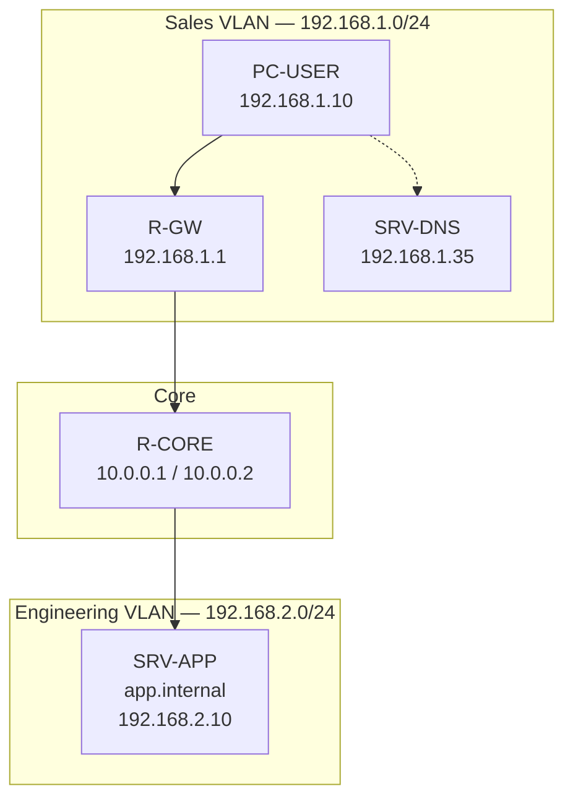

# Office LAN Topology — Broken Network Lab

## Overview

**Summit Office Network** — a small two-site LAN used to practice troubleshooting. A user PC on the Sales VLAN must reach an internal application server on the Engineering subnet and resolve names via the local DNS server.

## Logical Topology

## Device Roles

| Device | IP | Role |
|--------|-----|------|
| PC-USER | 192.168.1.10/24 | End user workstation |
| R-GW | 192.168.1.1/24, 10.0.0.1/30 | Sales default gateway |
| R-CORE | 10.0.0.2/30, 10.0.0.5/30 | Inter-VLAN routing |
| R-ENG | 10.0.0.6/30, 192.168.2.1/24 | Engineering gateway |
| SRV-DNS | 192.168.1.35/24 | Internal DNS (`app.internal`) |
| SRV-APP | 192.168.2.10/24 | Application server |

## WAN Links (Point-to-Point /30)

| Link | Addresses |
|------|-----------|
| R-GW ↔ R-CORE | 10.0.0.1 — 10.0.0.2 |
| R-CORE ↔ R-ENG | 10.0.0.5 — 10.0.0.6 |

## Intended Traffic Flow

1. PC pings gateway `192.168.1.1`
2. PC resolves `app.internal` via DNS `192.168.1.35` → `192.168.2.10`
3. PC sends packet to `192.168.2.10` via gateway
4. R-GW forwards to R-CORE → R-ENG → SRV-APP

## Lab Scenarios

Each scenario breaks one thing in an otherwise working network:

| # | Scenario | Symptom |
|---|----------|---------|
| 1 | Wrong gateway | PC cannot reach anything beyond local subnet |
| 2 | DNS misconfiguration | Ping to IP works; name resolution fails |
| 3 | IP conflict | Intermittent ARP / duplicate address behavior |
| 4 | Missing route | Gateway OK; remote subnet unreachable |

See [`scenarios/`](../scenarios/) for Problem → Diagnosis → Fix → Verification write-ups.

## Packet Tracer Notes

- Use 2911 routers for R-GW, R-CORE, R-ENG
- Use PC-PT and Server-PT for endpoints
- Apply `configs/baseline/` first, confirm connectivity, then swap in `configs/broken/` per scenario
