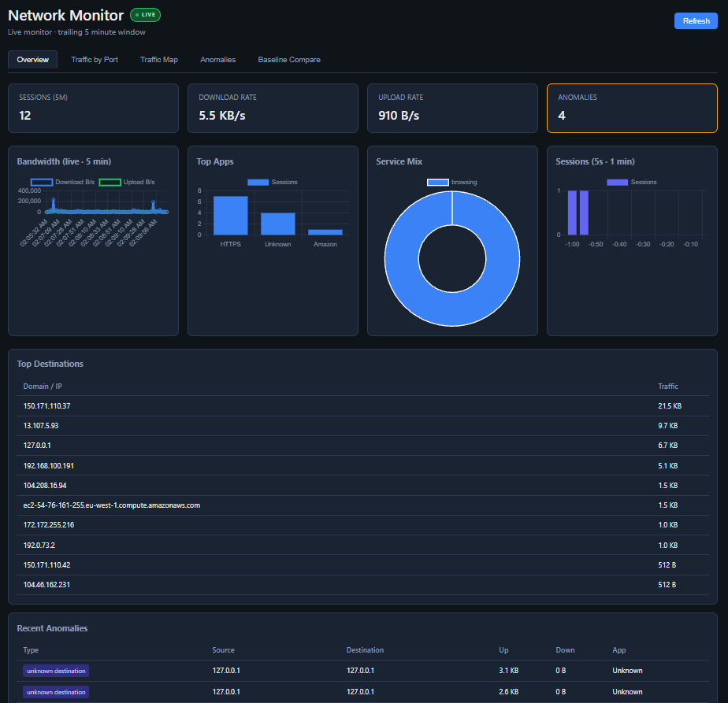
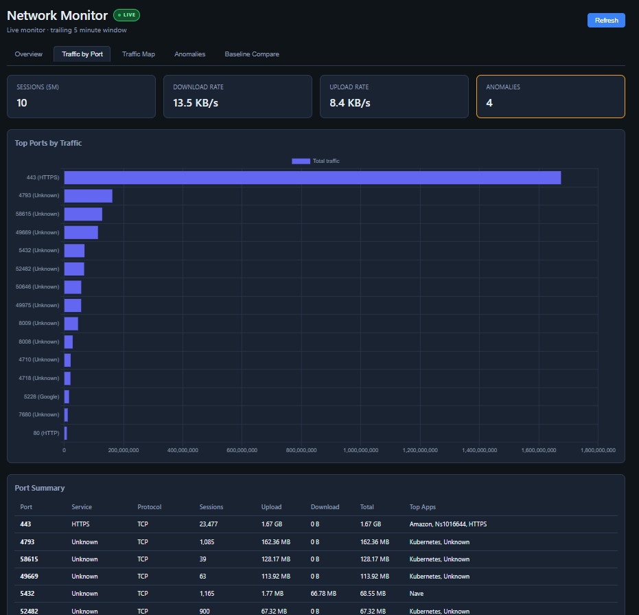
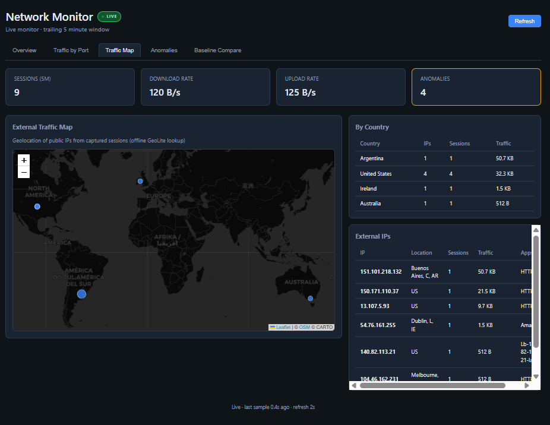
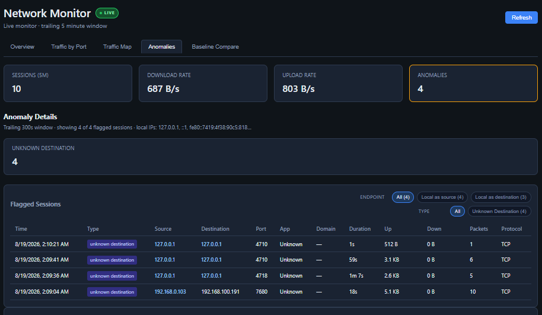
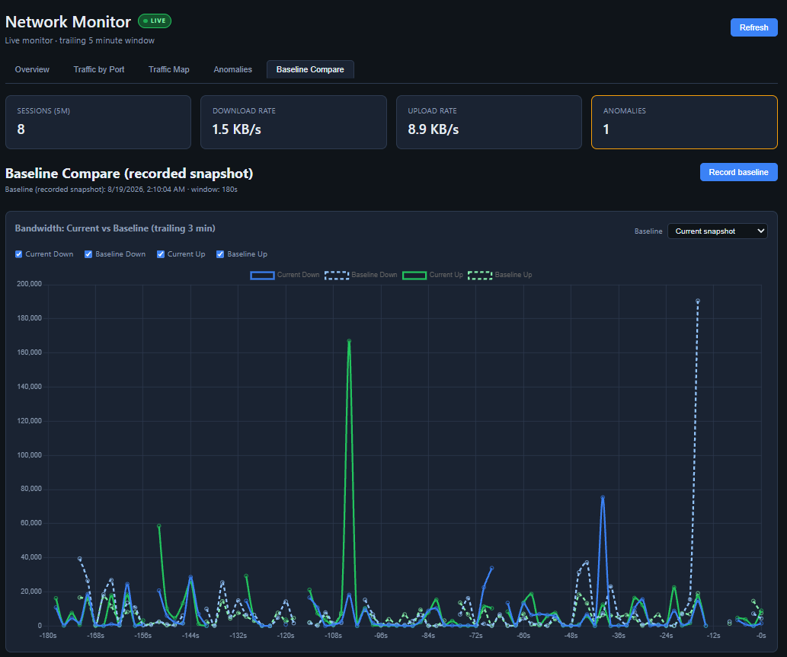

# Telecom Portfolio

The projects in this repository are based on information gathered from Network+ and Nokia 5G certifications.


## 01-subnetting-lab
To run:
```bash
python ./01-subnetting-lab/subnet_calculator.py
```
The program gives a menu.

MENU
1. Calculate subnet from CIDR
2. Add device to IP
3. Remove device from IP
4. Print subnets and assignments
5. Create tagged subnet
6. Remove tagged subnet

I started with just the calculator, and then decided to add a network simulation for assigning IPs. Some of the features I added were:
- Persistent storage (you can see the network I built)
- Reserved IPs for network ID and Broadcast ID (in the future could expand to cloud reservations)
- Subnet tags, for easily and clearly identifying subnet areas and assigned personnel


## 02-broken-network-simulation
```bash
python ./02-broken-network-simulation/simulator/run_lab.py
```
This project was developed along with the coursework and gives a hands-on feel to being a technician in the field.
The program simulates common problems a network technician may face.
- Wrong gateways
- DNS misconfiguration
- IP conflicts
- Missing routes

The user loads a scenario, and uses the tools to troubleshoot and correct the problem at hand.
```
Commands
  --------
  scenarios          List broken scenarios
  load <id>          Load a scenario (e.g. load wrong-gateway)
  status             Show current scenario / fault
  ipconfig [host]    Show PC settings (pc-user or pc-conflict)
  ping <host>        Ping an IP or hostname
  tracert <host>     Trace route to destination
  nslookup <name>    Query DNS
  set gateway <ip>   Set PC default gateway (wrong-gateway fix)
  set dns <ip>       Set PC DNS server (dns-misconfig fix)
  set dns-record <name> <ip>  Fix DNS zone on SRV-DNS
  ip route <net> <mask> <next-hop>  Add static route on R-CORE
  show ip route [router] Show routing table (default R-CORE)
  arp                Show ARP table
  fix                Apply the correct fix automatically
  verify             Run verification tests
  baseline           Reset to working network
```
After the solution is applied, the simulated system functionality returns and further diagnostics run successfully.


## 03-mini-isp-network-simulation
To run:
```bash
python ./03-mini-isp-network-simulation/simulator/run_simulation.py
```
This project represents a system built using the the free software Cisco Packet Tracer. The topology is as follows:

The ISP core sits between the Internet and a Distribution Switch, which then routes packets to 3 VLANs.

The program is helpful for learning:
- IP subnetting and address planning
- Router-to-switch hierarchical design
- VLAN configuration and inter-VLAN routing
- DHCP and DNS service integration
- Static routing and NAT/PAT concepts
- Systematic connectivity troubleshooting


## 04-ipdr-generator
Run
```bash
python ./04-ipdr-generator/generate_ipdr.py
```
This gives a snapshot of a random-seeded simulation that saves to a .csv for further analysis.
```
Generation Summary
  ----------------------------------------
  Records:        10,000
  Anomalies:      505 (5.0%)
  Total download: 35.92 GB

  By service type:
    streaming     2,540 (25.4%)
    browsing      2,449 (24.5%)
    gaming        1,967 (19.7%)
    social        1,590 (15.9%)
    voip          1,454 (14.5%)
```
This synthetic data is useful for:
- Telecom domain modeling (IPDR / CDR concepts)
- Data design
- Subscriber behavior analysis
- Anomaly-rich datasets for analytics and fraud ML

Overall this was more-or-less a study for the final network-monitor project, see below


## 05-network-monitor
This culmination project takes live data from your device and aggregates it into a proper network monitor, giving key insights to performance metrics, traffic types, port usage, app usage, and anomaly detection.

Install dependencies and then run the node
```bash
cd ./05-network-monitor/dashboard-node
npm install
npm start
```
Open http://localhost:3000/ to view the live dashboard. Navigate through the metrics using the tabs at the top.
You may be surprised by the types of traffic that go through your network.





